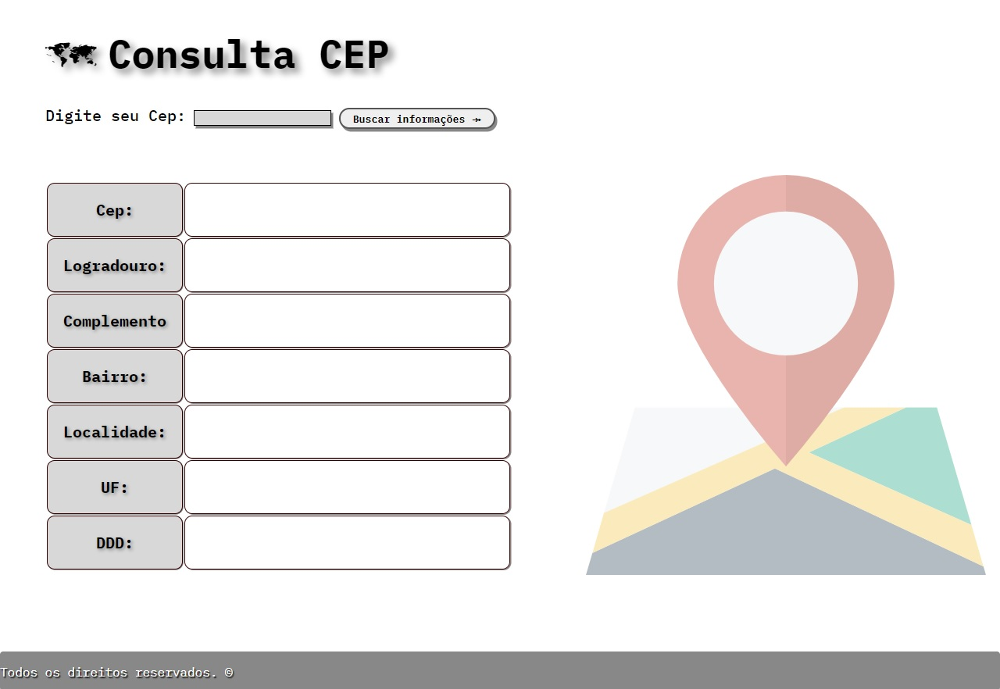
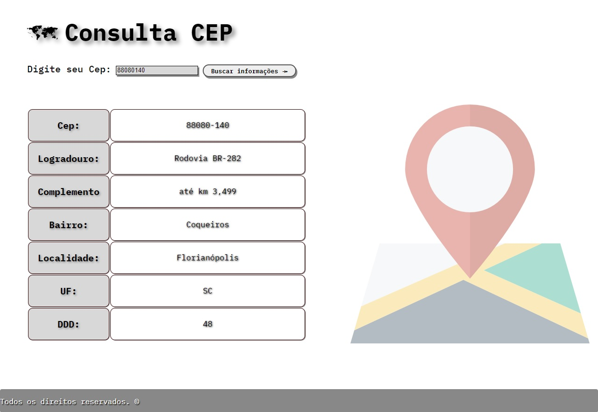
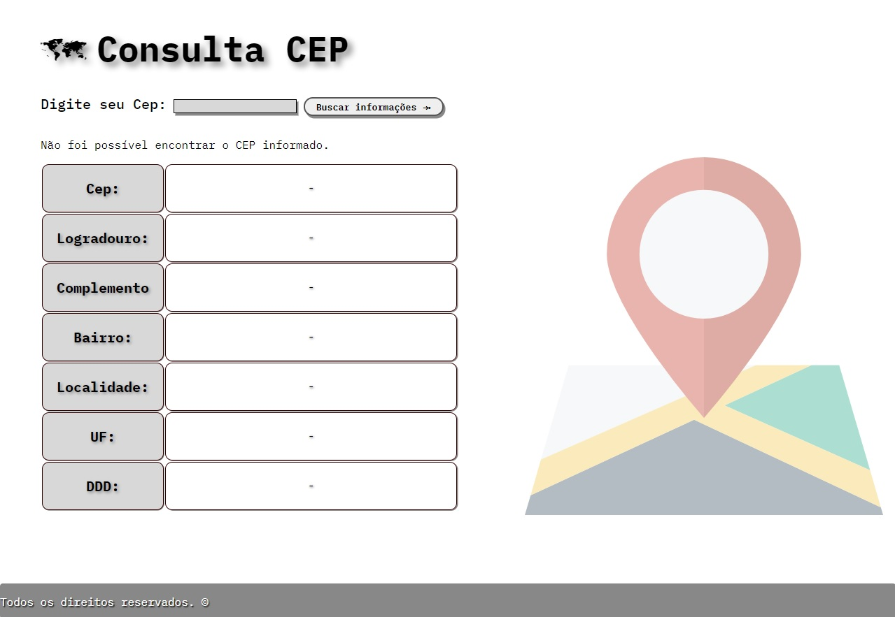

# Consulta_ViaCep
<h1>Consulta ViaCep<h1>

The project follows a similar line to Correios Busca CEP.

Developed to practice HTML, CSS, JavaScript and your requests using Fetch.

<h2>Screens</h2>
<table>
<tr>
<th>Initial Screen</th>
<td></td>
</tr>
<tr>
<th>Information found</th>
<td></td>
</tr>
<tr>
<th>Information not found</th>
<td></td>
</tr>
</table>

<h2>Getting Started</h2>
<pre>
<code>-git clone https://github.com/SetropLeo/Consulta_ViaCep</code>
</pre>

<h2>Built With</h2>
<ul>
<li>HTML5</li>
<li>CSS3</li>
<li>JavaScript</li>
</ul>

<h2>Contributions</h2>
<a href="Origamid">https://origamid.com/</a>
 
<a href="W3Schools">https://w3schools.com/</a> 
